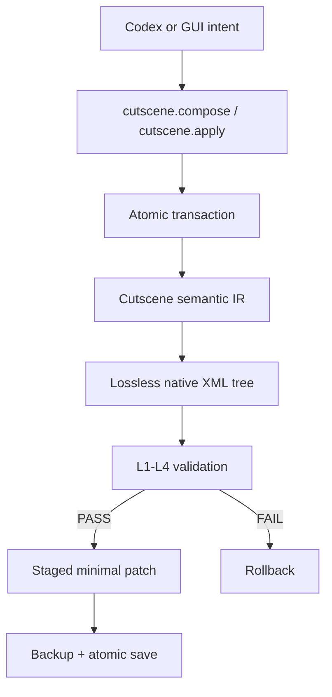

# Cutscene module architecture

Status: `1.1.0-alpha.5`, discovery-first foundation pinned to the supplied SC2Editor `5.0.16.97563`, a materialized 1,488-file native StormCutscene corpus, and multi-source asset/M3 metadata indexing. This is intentionally not labelled the complete Cutscene v1 bridge.

## Boundaries

`modules/cutscene` is independent of UI layout implementation details. It shares only the workspace root, filesystem conventions and the process-level MCP server. Its parser, IR, schema registry, operations and validation are Cutscene-specific.

The native tree is the preservation authority. The semantic IR is a typed view, not a replacement serializer. Unknown attributes, children, property tokens, enum tokens, ordering and raw text stay in the original document unless an operation targets their exact source span.

| Component | Responsibility |
|---|---|
| `document.ts` | Source-span parser facade, generic objects, exact source, minimal patches |
| `types.ts` | IR, ExtensionBag, typed values, operations, coverage statuses |
| `schemaRegistry.ts` | Merge verified bootstrap data with generated discovery |
| `discovery.ts` | Scan real Cutscenes and Galaxy natives |
| `peDiscovery.ts` | Read-only PE metadata, ASCII/UTF-16 strings, Cutscene class/property/enum and RTTI evidence |
| `operations.ts` | Alias-aware batch operations and high-level gates |
| `workspace.ts` | Staging, optimistic hashes, diff, backup, atomic save/export |
| `validator.ts` | L1 XML through L4 semantics; explicit L5/L6 unavailable states |
| `assets.ts` | Lazy dependency-aware local catalog index |
| `runtime.ts` | Runtime capabilities, external adapter, signature-gated Galaxy generation |
| `tools.ts` | Compact `cutscene.*` MCP surface |

Large SC2 GUIDs remain strings and are never converted through JavaScript `number`. Selectors accept `guid:…`, `name:…`, `node:…` or a structured selector. Transaction aliases such as `@marine` resolve to a stable native GUID.

`preserveNative=true` is the default. A no-op open/save path never invokes a DOM normalizer. Attribute updates replace only the quoted value span. `raw.patch` is a last resort and rolls back immediately if it makes XML malformed.

The supplied Windows SC2Editor is now statically indexed read-only. Typed Camera fields confirmed by both its property registry strings and the corpus are enabled; EXE-only fields remain generic or editor-only according to provenance. L5 cannot be claimed in this Linux environment because the Windows Editor was not executed. A high-level call still refuses to guess an unobserved native field, while generic native operations and lossless round-trip remain available.
