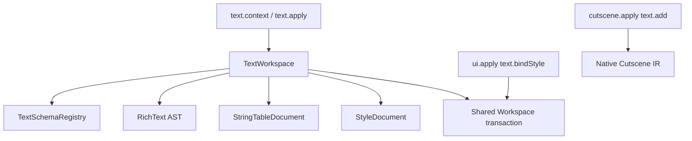

# Text module architecture

The module lives in `src/modules/text` and depends only on shared Core services. Cutscene and UI do not own the Font Style registry.



## Layers

`StyleDocument` is the native `.SC2Style` source-span model. It does not normalize the entire document. It indexes `Style`, `Constant`, `FontGroup` and `CodepointRange` while preserving every other node as raw source.

`StringTableDocument` represents `Key=Value` resources. It stores exact offsets for each value, so changing one translation replaces only that value. BOM, line endings, ordering and comments survive.

`RichTextDocument` is a lossless SC2-specific AST. Known formatting tags are semantic nodes; unknown tags remain tag/raw nodes with original spelling, attributes, quotes and order. It is deliberately not an HTML parser.

`TextSchemaRegistry` loads generated build-pinned discovery data and the bundled Core style index. It validates typed style values and provides standard style search without rescanning Core at each MCP request.

`TextWorkspace` composes all layers into one transaction. It uses the existing `Workspace` draft map, optimistic hashes, backups and atomic writes, so `.SC2Style` staged by `text.apply` is immediately visible to `ui.validate`.

## Identity and values

Styles and constants preserve their native identifiers. A native value beginning with `#` is represented as a reference plus its resolved value; inspection never replaces the original token with a literal.

```json
{
  "nativeValue": "#FontSizeMedium",
  "reference": "FontSizeMedium",
  "resolvedValue": "24"
}
```

Flag negation is native semantics. `!Shadow|Glow` is preserved exactly. Effective-style computation walks templates first and then overlays declared attributes; it reports the chain used.

## Transaction boundary

`text.apply` declares every file it may modify, clones current draft/disk sources, applies all operations, validates the complete candidate set and only then stages or writes. Cross-locale updates are therefore all-or-nothing at the logical transaction level.

For direct multi-file writes, all temporary files are prepared before replacement. Existing files receive backups by default. If a rename fails, already replaced targets are restored from the captured original source.

## Forward compatibility

- Unknown `.SC2Style` children remain outside mutation spans.
- Unknown style attributes remain on their original element.
- Unknown enum/flag tokens are preserved; validation never substitutes defaults.
- Unknown rich-text nodes retain raw open/close markup.
- New Text Editor builds can regenerate JSON registries with `npm run text:discover`.
